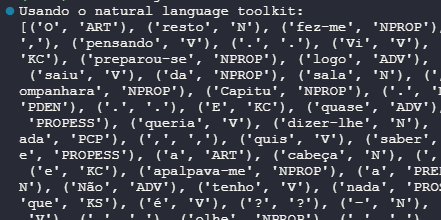

<h1> Processamento de Linguagem Natural FATEC </h1>
<h2> Gabriel Camargo Leite - Thiago Henrique Ferreira </h2>

  

**TERMINOLOGIA E CONCEITOS**

**TC.1.1.** Selecione uma obra literária de domínio público (ex. livros tais como Vinte mil léguas
submarinas (de Júlio Verne), a Bíblia, etc.) e ilustre a variedade de dados presente. Considere,
por exemplo a construção de frases, orações etc. e compare com expressões de uso corrente.

### **PG.42 Dom Casmurro**

— Mas tu gostavas tanto de ser padre, disse ela; não te lembras que até pedias
para ir ver sair os seminaristas de São José, com as suas batinas? Em casa,
quando José Dias te chamava Reverendíssimo, tu rias com tanto gosto! Como é
que agora?... Não creio, não, Bentinho. E depois... Vocação? Mas a vocação vem
com o costume, continuou repetindo as reflexões que ouvira ao meu professor de
latim.

### Utilização das palavras no trecho

1. **Construção de Frases Complexas:** O trecho contém frases relativamente longas e compostas.
2. **Uso de Expressões e Idiomas Específicos:** Expressões como "sair os seminaristas de São José" e "José Dias te chamava Reverendíssimo" estão relacionadas a contextos específicos da história e da época.
3. **Comparação com expressões de uso corrente**:
Mas **tu gostavas** tanto de ser padre - Mas **você gostava** tanto de ser padre

### Utilização das palavras no cotidiano

1. **Construção de Frases Diretas:** Na linguagem cotidiana, é mais comum usar frases mais curtas e diretas, o que facilita a compreensão rápida.
2. **Vocabulário Simples:** No dia a dia, usamos palavras mais simples e modernas, evitando termos formais ou arcaicos (ex: Vosmecê, Outrossim, Quiçá).
3. **Uso de Linguagem Informal:** Expressões informais e uso de gírias são mais comumente usadas atualmente.

  

**TC.1.2.** Exemplifique uma sentença, escrita na língua portuguesa, que pode surgir em um site de
pré-atendimento em uma concessionária, que potencialmente seja difícil de ser interpretado por
um chatbot. Explique sua resposta em termos de estruturação da sentença e suponha que ela
esteja gramaticalmente correta.

Frase: **O mapa está incluso na compra desse veículo?**
O Chatbot terá dificuldades de interpretar a frase acima por conta da ambiguidade, podendo ser o mapa físico ou GPS;
Talvez ele também não saiba todos os recursos do veículo.

  

**TC. 1.3.** Sistemas de PNL são geralmente compostos por modelos que são treinados utlizando
corpora de texto. Por que modelos que são válidos hoje podem não mais ser adequados daqui a
dois anos?

Porquê a cultura não é estática, com o passar dos anos evolui e surgem novas expressões, palavras e novos significados.  Termos em inglês foram aportuguesados.

  

**TC.1.4.** Por que a utlização de emojis ou outros símbolos não presentes na linguagem textual
formal podem dificultar a operação de um sistema de PNL?

Porque não é possivel executar análise de semantica nos emojis, além de não expressarem bem o sentido de uma frase gerando confusões, pela alta dependência de contexto. 

  

**TC.1.5.** Dê um exemplo de sentença em um processo comunicativo onde a os referentes
considerados pelo transmissor e pelo receptor podem ser distintos caso não haja adequada
contextualização do processo comunicativo.

“João viu sua vizinha com óculos” - Quem estava com o óculos ?

  

**TC.1.6.** Exemplifique uma a saída para o processo de lematização e stemização. Considere a
seguinte sentença:
**“Assim que amanheceu, os estudantes, apressados, acordaram e saíram correndo para fazer a
prova”.**

| Palavra | Lematização | Stemização |
| --- | --- | --- |
| Assim | Assim | Assim |
| Que | Que | Que |
| Amanheceu | Manhã | Manh |
| Os | O | O |
| Estudantes | Estudo | Estud |
| Apressados | pressa | Press |
| Acordaram | Acorda | Acord |
| E | E | E |
| Saíram | Sair | Sair |
| Correndo | Correr | Corr |
| Para | Para | Para |
| Fazer | Fazer | Faz |
| A | A | A |
| Prova | Prova | Prova |

**Lematização**:
“Assim que manhã, o estudo, pressa, acorda e sai correr para fazer a prova”.

**Stemização**:
“Assim que manh, o estud, press, acord e sair corr para faz a prova”.

  

**TC.1.7.** Cite dois possíveis usos das tags do tipo POS. Forneça exemplos com sentenças simples,
expressas na língua portuguesa ou inglesa. 

As tags POS são como etiquetas que ajudam a classificar palavras em uma frase. Elas mostram se uma palavra é um substantivo, verbo, adjetivo, advérbio, etc. Basicamente, elas ajudam a entender o papel das palavras nas frases.

- Inglês: "**She sings beautifully**" (Ela canta lindamente.)
    - Tags POS:
        - **She** - PRP (pronome),
        - **sings** - VBZ (verbo no presente),
        - **beautifully** - RB (advérbio)
- Português: "**Ele corre rapidamente**"
    - Tags POS:
        - **Ele** - PRON (pronome),
        - **corre** - V (verbo no presente),
        - **rapidamente** - ADV (advérbio)

  

**PP.1.1** Baseando-se no código-fonte fornecido pelo professor, exemplifique o carregamento da
biblioteca NLTK, em Python e efetue a tokenização de um texto em português pertencente a
alguma obra literária de domínio público. UƟlize um texto de pelo menos 2000 caracteres.
Mostre o funcionamento do seu programa e descreva ao menos 5 POS tags.

> print do resultado do arquivo “intro_pt.py”.
> 

V - Verbo

ART - Artigo

NPROP - Nome Proprio

ADV - Advérbio

N - substantivo

  

**PP.1.2.** Exemplifique a stemização e a lematização de um texto, em língua portuguesa. Ilustre
um caso onde textos diferentes conduzem a uma mesma saída através do stemming ou
lemmatization. Considere como saída um vetor ordenado contendo lemas e stems.

> print do resultado do arquivo “lemma-stem_pt.py”.
> 

  

**PP.1.3.** Repita PP.1.1. considerando a língua inglesa.

> print do resultado do arquivo “intro_en.py”.
> 

IN - Preposição

VBP - Verbo no passado 

NN - Substantivo

NNS - substantivo no plural

RB - Advérbio

  

**PP.1.4.** Repita PP.1.2. considerando a língua inglesa.

> print do resultado do arquivo “lemma-stem_en.py”.
>